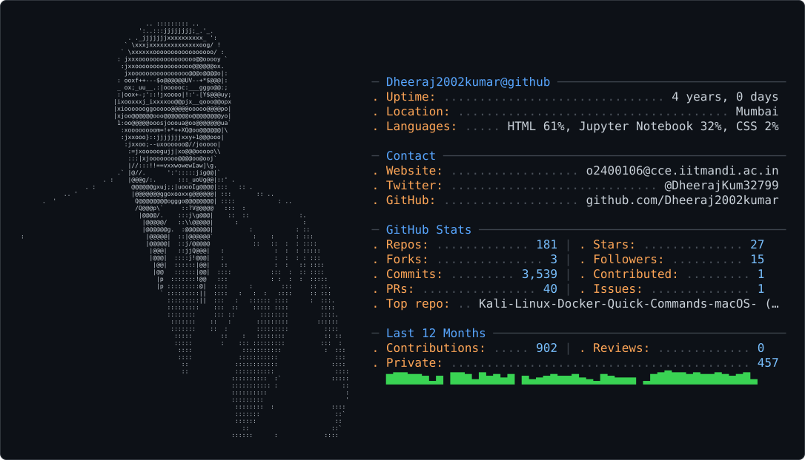

  <picture>
    <source media="(prefers-color-scheme: dark)" srcset="dark_mode.svg" />
    <source media="(prefers-color-scheme: light)" srcset="light_mode.svg" />
    
  </picture>

 

<!-- ======================================================= -->
<!--                   HERO BANNER & HEADER                  -->
<!-- ======================================================= -->

  <!--  -->

  

  

    
    
    
    
    
  

 

<!-- ======================================================= -->
<!--                   ABOUT ME & DASHBOARD                  -->
<!-- ======================================================= -->

## 💫 About Me

<table width="100%" border="0" cellpadding="12" cellspacing="0">
  <tr>
    <td width="55%" valign="top">
      

        🎓 <b>Master of Computer Applications (MCA)</b> 
        &nbsp;&nbsp;&nbsp;&nbsp;<i>Amity Institute of Information Technology, Mumbai</i>
      

      

        🎓 <b>Minor in Computer Science & NextGen Technologies</b> 
        &nbsp;&nbsp;&nbsp;&nbsp;<i>IIT Mandi (CCE)</i>
      

      

        💻 <b>Full Stack & Frontend Engineering:</b> Passionate about crafting lightning-fast, accessible, and scalable web applications with intuitive UX.
      

      

        🤖 <b>AI & Next-Gen Systems:</b> Exploring agentic workflows, LangGraph pipelines, and intelligent automations integrated with full-stack architectures.
      

      

        🌱 <b>Currently Leveling Up:</b> Advanced System Design, Docker, Kubernetes, AWS Cloud, Distributed Systems, and DSA Problem Solving.
      

      

        💬 <b>Ask Me About:</b> React 19, Next.js, TypeScript, Node.js, Express, Tailwind CSS, PostgreSQL, MongoDB, REST APIs & Git.
      

      

        ⚡ <i>"I love transforming complex engineering challenges into clean, elegant, and high-performance digital experiences."</i>
      

    </td>
    <td width="45%" valign="top" align="center">
      <h4 align="center">🏆 LeetCode Activity & Problem Solving</h4>
      
        
      

        
        
        
      

    </td>
  </tr>
</table>

---

<!-- ======================================================= -->
<!--                     TECH STACK                          -->
<!-- ======================================================= -->

## 💻 Tech Stack & Toolkit

<table width="100%" border="0" cellpadding="10" cellspacing="0">
  <tr>
    <td width="50%" valign="top">
      <h4>🎨 Frontend Development</h4>
      

        
      

       
      <h4>⚙️ Backend & API Architecture</h4>
      

        
      

       
      <h4>🗄️ Databases & Storage</h4>
      

        
      

    </td>
    <td width="50%" valign="top">
      <h4>☁️ Cloud, DevOps & CI/CD</h4>
      

        
      

       
      <h4>🧠 Programming Languages</h4>
      

        
      

       
      <h4>🤖 AI, Data & Developer Tools</h4>
      

        
      

      

        
        
        
        
      

    </td>
  </tr>
</table>

---

<!-- ======================================================= -->
<!--                 FEATURED PROJECTS MATRIX                -->
<!-- ======================================================= -->

## 🚀 Featured Projects

<table width="100%" border="0" cellpadding="12" cellspacing="0">
  <tr>
    <td width="50%" valign="top">
      <h3>🏥 MedFlow AI (Hospital Triage)</h3>
      
An intelligent hospital triage agent routing patients to medical departments by urgency with dynamic doctor scheduling.

      <ul>
        <li><b>Stack:</b> FastAPI • LangGraph • Llama 3.3 • Python</li>
        <li>Safety routing guardrails & real-time slot allocation database</li>
        <li>Modern glassmorphic dashboard UI with interactive schedules</li>
      </ul>
      

        
        
      

    </td>
    <td width="50%" valign="top">
      <h3>🎟️ QEvent Portal</h3>
      
A premium Event Discovery and exploration platform to search, filter, explore, and register for community events.

      <ul>
        <li><b>Stack:</b> Next.js 14 (App Router) • Tailwind CSS • Next-Auth</li>
        <li>Secure Google OAuth provider integration</li>
        <li>Dynamic hero carousel with Swiper & interactive event creation</li>
      </ul>
      

        
        
      

    </td>
  </tr>
  <tr>
    <td width="50%" valign="top">
      <h3>🏢 Vindhyavashani Services</h3>
      
A high-performance industrial enterprise platform with SSR, responsive design, and SEO optimization.

      <ul>
        <li><b>Stack:</b> React 19 • TypeScript • TanStack Start • Nitro</li>
        <li>Tailwind CSS v4 & modern Shadcn UI component system</li>
        <li>Seamless Dark / Light mode switching & lightning-fast page loads</li>
      </ul>
      

        
      

    </td>
    <td width="50%" valign="top">
      <h3>🎉 XEventsApp</h3>
      
Full Stack Event Management Platform featuring role-based dashboards and automated media uploads.

      <ul>
        <li><b>Stack:</b> MERN Stack (MongoDB, Express, React, Node.js)</li>
        <li>JWT Authentication, Google OAuth & Cloudinary media integration</li>
        <li>Dedicated Admin, Organizer, and Participant dashboards</li>
      </ul>
      

        
      

    </td>
  </tr>
  <tr>
    <td width="50%" valign="top">
      <h3>🛒 QKart E-Commerce</h3>
      
Modern full-flow E-Commerce web application replicating end-to-end user shopping and checkout journeys.

      <ul>
        <li><b>Stack:</b> React.js • REST APIs • Material UI</li>
        <li>Dynamic product catalog, debounced search, and cart management</li>
        <li>Secure customer authentication & responsive checkout flow</li>
      </ul>
      

        
      

    </td>
    <td width="50%" valign="top">
      <h3>🎵 QTify Music Streaming</h3>
      
Music streaming and discovery platform featuring customized top/new album sliders and song libraries.

      <ul>
        <li><b>Stack:</b> React.js • Material UI (MUI) • Swiper.js</li>
        <li>Interactive genre-filtered song tabs and custom album carousels</li>
        <li>Custom audio player integration with fluid media layouts</li>
      </ul>
      

        
      

    </td>
  </tr>
  <tr>
    <td width="50%" valign="top">
      <h3>📰 XBoard News Aggregator</h3>
      
Multi-category news aggregator portal featuring real-time REST API ingestion and smooth infinite scrolling.

      <ul>
        <li><b>Stack:</b> React.js • External News REST APIs • CSS Grid</li>
        <li>Infinite scroll mechanism for continuous content consumption</li>
        <li>Category-based article filtering and responsive layouts</li>
      </ul>
      

        
      

    </td>
    <td width="50%" valign="top">
      <h3>🐳 DevOps & Kali Container Lab</h3>
      
Dockerized development environment scripts and quick-command workflows for macOS & Linux engineers.

      <ul>
        <li><b>Stack:</b> Docker • Bash Scripting • Linux Kernel Tools</li>
        <li>Containerized isolated workspaces with custom network setups</li>
        <li>Automated developer shortcuts and quick deployment templates</li>
      </ul>
      

        
      

    </td>
  </tr>
</table>

---

<!-- ======================================================= -->
<!--               CERTIFICATIONS & 2026 ROADMAP             -->
<!-- ======================================================= -->

## 🏆 Credentials & 2026 Vision

<table width="100%" border="0" cellpadding="10" cellspacing="0">
  <tr>
    <td width="50%" valign="top">
      <h3>📜 Certifications</h3>
      <ul>
        <li>
          🎓 <b>Minor in CS & NextGen Technologies</b> 
          <i>IIT Mandi (CCE)</i>
        </li>
        <li>
          🎓 <b>Full Stack Development Fellowship</b> 
          <i>Crio.Do</i>
        </li>
        <li>
          🎓 <b>Data Science Certification</b> 
          <i>Simplilearn × IBM</i>
        </li>
      </ul>
    </td>
    <td width="50%" valign="top">
      <h3>🎯 2026 Roadmap & Milestones</h3>
      <ul>
        <li>✅ Master Production MERN & Next.js Architectures</li>
        <li>✅ Containerize apps with Docker & deploy to AWS</li>
        <li>🚀 Build Agentic AI apps with LangGraph & LLM APIs</li>
        <li>🚀 Solve 500+ LeetCode DSA Problems (Target: Knight)</li>
        <li>🚀 Master System Design, Microservices & CI/CD Pipelines</li>
        <li>🌟 Contribute actively to High-Impact Open Source Repos</li>
      </ul>
    </td>
  </tr>
</table>

---

<!-- ======================================================= -->
<!--                 GITHUB ACTIVITY & STATS                 -->
<!-- ======================================================= -->

## 📊 GitHub Analytics & Activity

  

 

<h3 align="center">📈 3D Isometric Contribution Graph</h3>

  

<h3 align="center">🐍 Contribution Activity Snake</h3>

  <picture>
    <source media="(prefers-color-scheme: dark)" srcset="https://raw.githubusercontent.com/Dheeraj2002kumar/Dheeraj2002kumar/output/github-contribution-grid-snake-dark.svg" />
    <source media="(prefers-color-scheme: light)" srcset="https://raw.githubusercontent.com/Dheeraj2002kumar/Dheeraj2002kumar/output/github-contribution-grid-snake.svg" />
    
  </picture>

---

<!-- ======================================================= -->
<!--               COLLABORATION & PHILOSOPHY                -->
<!-- ======================================================= -->

## 💡 Engineering Philosophy & Collaboration

  <blockquote>
    <i>"First, solve the problem. Then, write the code."</i> — <b>John Johnson</b>
  </blockquote>

<table width="100%" border="0" cellpadding="10" cellspacing="0">
  <tr>
    <td width="50%" valign="top">
      <h3>🤝 Open to Collaborate On:</h3>
      <ul>
        <li>🚀 Scalable Web Applications (Next.js, React, Node.js)</li>
        <li>🤖 Agentic AI & LLM-Powered Workflows</li>
        <li>🌐 Open Source Developer Tooling & Libraries</li>
        <li>☁️ Cloud-Native & Containerized Microservices</li>
      </ul>
    </td>
    <td width="50%" valign="top">
      <h3>💼 Seeking Opportunities:</h3>
      <ul>
        <li>⭐ <b>Full Stack Developer</b> (MERN / Next.js / Node.js)</li>
        <li>⭐ <b>Frontend Software Engineer</b> (React / TypeScript)</li>
        <li>⭐ <b>Software Development Engineer (SDE)</b> Intern / Full-Time</li>
      </ul>
    </td>
  </tr>
</table>

---

<!-- ======================================================= -->
<!--                     LET'S CONNECT                       -->
<!-- ======================================================= -->

## 📬 Let's Connect & Build Together

  
  
  
  
  

 

  <h3>✨ Thanks for visiting my GitHub profile!</h3>
  
⭐ If you find my projects helpful or interesting, feel free to give them a star!

  

